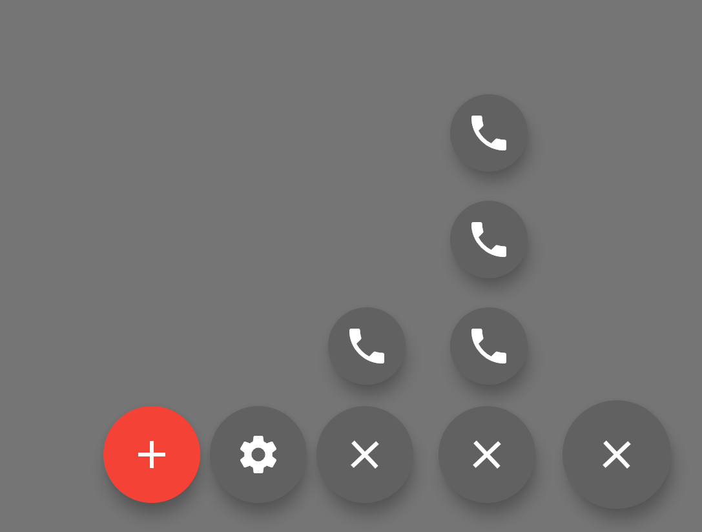

# tst_expandable_bottom_menu

    

        

            		<b>Current situation derived from Unicorndial:</b>
            		  https://pub.dev/packages/unicorndial
            	

          	
    

    

        

              		<b>Desired result:</b>
              	

          	
    

    

# Todos
- [x] 1. <b>Make the buttons align perfectly</b> (it seems they are a bit mis aligned)
    

        
    

- [x] 2. <b>Only one sub-branch can be opened at a time</b>. So, when we click the "clock" and then click the "person". 
         The "clock"-branch should close. 
  

          
  

- [x] 3. <b>All branches of the menu should collapse when we click on the background</b> (I made the background purple, just so it is easier to understand what I mean with background)
    

            
    

- [x] 4. <b>All branches of the menu should collapse when we press the bank/phone button </b>(when we press the 2nd branch button)
    

            
    

- [x] 5. <b>All branches of the menu should collapse when we press the big X</b> (the main floatingactionbutton)
    

          
    

- [ ] 6. <b>When we add more buttons the spacings should be equal.</b> Please set a variable so I can adjust the spacing in 1 place.
    

          
    

- [ ] 7. <b>When we add more buttons they should automatically only allow for 1 branch to be open at a time</b> It needs to be scalable, 
        so I need to be able to add and remove buttons without having to change the code too much.
    

          
    

- [ ] 8. <b>Implement a bool value that we can change (changing inside the code for now is fine, I will implement a user prefs setting in my app).
          If true => the menu will only collapse to the horizontal branch (except when we hit the big X)
          If false => the whole menu will collapse (like the current situation)   
        div class="imgContainer">
              
        

    